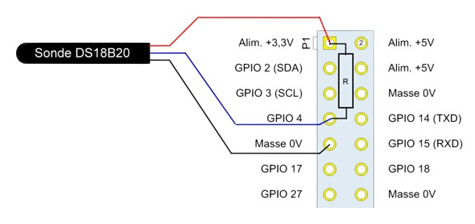

# Utilisation du bus one wire sur Raspberry pi 2 en C

Le but de ce mini-projet est de réaliser une centrale de mesure de température avec indicateur local de dépassement.

- L’indicateur local de dépassement de la température de référence est une LED connectée à une broche GPIO ou la LED verte déjà présente sur la carte et qui sert normalement à visualiser les accès à la carte micro-SD.
- Le capteur de température est un DS18B20 connecté à une broche 1-wire.
- L’interface graphique est un site web permettant à l’utilisateur de lire les températures mesurées et de référence et de configurer la température de référence.
- Le système doit pouvoir être accédé à distance au moyen d’une connexion sécurisé.

# Câblage

http://www.framboise314.fr/mesure-de-temperature-1-wire-ds18b20-avec-le-raspberry-pi/ 

La résistance pourra prendre 4,7k pour valeur.

# LED verte de la carte Raspberry Pi

Le support kernel pour les LED est intégré lors de la compilation du noyau (make linux-menuconfig)  en activant l'option « LED Support for GPIO connected LEDs » dans le sous-menu LED support du menu Device Drivers. Avec le Raspberry Pi, cette option se traduit par l'apparition d'un sous-répertoire led0 dans <code>/sys/class/leds</code>.

Dans le même sous-menu de configuration du kernel, on peut choisir des déclencheurs (triggers) – c'est-à-dire des heuristiques commandant l'allumage ou l'extinction des LED. Le trigger sera sélectionné en écrivant son nom dans /sys/class/leds/led0/trigger.

Plusieurs heuristiques sont disponibles, en voici quelques-unes :

- <code>none</code> : la LED est pilotée manuellement en écrivant  0 ou 1 dans <code>/sys/class/leds/led0/brightness</code>.
- <code>timer</code> : (module ledtrig-timer.ko compilé grâce à l'option « LED Timer Trigger » lors de la configuration du noyau) la LED clignote suivant un cycle dont on peut contrôler les durées d'allumage et d'extinction en indiquant les valeurs en millisecondes dans les fichiers <code>/sys/class/leds/led0/delay_on</code> et <code>/sys/class/leds/led0/delay_off</code>.
- <code>heartbeat</code> : (module <code>ledtrig-heartbeat.ko</code> dépendant de l'option « <code>LED Heartbeat Trigger</code> ») pour ce trigger, la LED simule un battement de cœur avec une fréquence qui dépend de la charge système (c'est celui que nous choisirons plus bas).
- <code>backlight</code> : (option « <code>LED Backlight Trigger</code> ») : utilisé lorsque la LED sert de rétro-éclairage pour un écran.
- <code>mmc0</code> : intégré directement dans le driver <code>mmc-core</code>, ce trigger allume la LED lors des accès à la carte SD.

# Utilisation du bus one wire

Les drivers du bus 1-wire ne sont pas inclus dans le noyau mais sont présents dans le système sous forme de module créé lors de sa compilation. 

<code># modeprobe -a w1-gpio</code>

L’installation de se module monte dans le système de fichiers une nouvelle arborescence <code>/sys/bus/w1/devices</code> dans lequel on trouve un dossier portant comme nom l’adresse d’un périphérique connecté au bus 1-wire.  C’est le fichier <code>w1_slave</code> qui contient la température en millième de degrés.

<syntaxhighlight lang="shell">
/sys/bus/w1/devices $ ls
28-0000054c2ec2
/sys/bus/w1/devices $ cd 28-0000054c2ec2
/sys/bus/w1/devices/28-0000054c2ec2 $ ls
driver id name power subsystem uevent w1_slave
/sys/bus/w1/devices/28-0000054c2ec2 $ cat w1_slave
7c 01 4b 46 7f ff 04 10 09 : crc=09 YES
7c 01 4b 46 7f ff 04 10 09 t=23750
</syntaxhighlight>

# Serveur web et prise en main à distance sécurisée

Ces deux fonctionnalités peuvent être réalisées par l’ajout de packages.

Le serveur web pourrait être lighttpd ou nginx auquel on pourrait ajouter php. Il peut également être construit au moyen de la librairie libwebsockets.

La prise en main à distance doit être réalisée au moyen d’un serveur ssh. 
 
Vous pourrez utiliser au choix le package dropbear ou openSSH. Dans les deux cas, il faudra au préalable sécuriser l’accès local au système en créant un mot de passe pour root.
 
# Serveur  websockets

Le serveur utilise la librairie libwebsockets :

- Include : <source>/usr/include/libwebsockets.h</source>
- Lib : 	<source>/usr/include/libwebsockets.so</source>, <source>/usr/include/libwebsockets.so.6</source>
- Exemple de serveur websockets : <source>serveurws.c</source>

